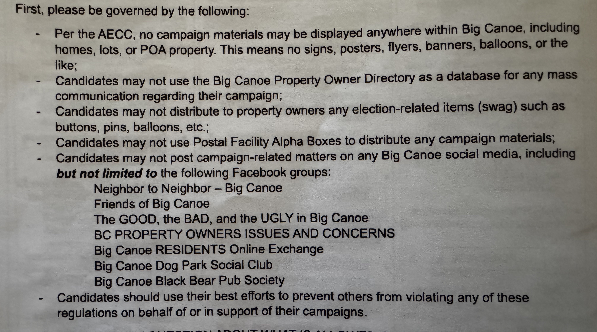

## Qualifying for the Election

On June 2nd, 2025 there was a Board Candidate Info Meeting, which I attended. At that meeting the current Board members answered questions from a moderator, and from the attendees. Anyone interested in running for the Board was encouraged to take an Election Packet, which required signing a form stating that you took one. I signed, and took my packet.

**In order to qualify to run for the board, a candidate must:**
- Own property in Big Canoe for a period of at least twenty-four (24) consecutive months prior to the date of the Primary Election;
- Be at least twenty-one (21) years of age by the Primary Election date;
- Be in good standing with the POA at the time of qualifying;
- Secure signature from at least twenty-five (25) different Property Owners representing at least twenty-five (25) of the Lots in Big Canoe;
- Be willing to authorize a criminal background check by the POA, if requested.

The deadline to submit the petition for Candidacy was June 30, 2025. I meet all the criteria, and submitted my petition to Jayne Hagan before the deadline.

----

## The Candidates

### Six candidates qualified for the election: Bob Kelley, Bill Thurber, Mike Volk, Roger Hackler, Lynette Howard, and myself.

Because there are 6 candidates for 2 open board positions (Terry Stewart and Mark Green are finishing their terms this year); this requires a primary election be held in August to bring the field down to 4 candidates.  Those 4 candidates will run in the general election in November with the final 2 winners announced at the POA Annual Meeting on December 6th.

----

## Campaign Guidelines Restrict Free Speech

The Election Packet also provides some guidelines for participation in the election, seen below.

Most of these seem reasonable. Not having campaign yard signs and flyers all across Big Canoe is one of the things I love about living here. There's no clutter to disrupt the natural beauty.

However, I take issue with the POA attempting to restrict free speech and public discourse. [More on that here](public-discourse).

----

## Equality in the Election Process

Once qualified, which I did, the Election Committee holds a meeting to go over the Primary election timeline, bio questions, and schedule headshots with the Communication department. This meeting is held on Monday July 14th, 2025. The eligible candidates were broken into two groups:

**Group One:** Bob Kelley, Bill Thurber, Mike Volk.
**Group Two:** Roger Hackler, Lynette Howard, and myself.

This struck me as strange. Why separate the candidates into two groups? In [a previous email](public-campaign-discourse.pdf) Election Committee Chair, Elizabeth Littleton, emphasized the importance the Election Committee places on *"providing a level playing field and fair elections for all candidates"* and *"ensuring equality"*. 

I asked Ms. Littleton why the candidates were being divided into two groups, and suggested we all meet as one group to ensure that all candidates get the same information, delivered in the same format, from the same people, at the same time. 

She declined, insisting on two separate meetings. [See the email exchange here](Upcoming-Election-Information.pdf).

----

## Assume Positive Intent

This is a mantra of mine that I've carried with me for decades. I believe Ms. Littleton, the Election Committee, and the POA management genuinely want what's best for Big Canoe. They are dedicating their time and attention to noble causes, and they deserve our gratitude. However, we need to look at the outcome and impact of these policies to ensure they align with our broader morals. 

Is stifling free speech, and tightly controlling the process so that all information is filtered through one group of people the way we run our democracy? Is that what our civilization, country, and community stand for? No. **That's not democratic. It's state controlled media.**

You might say, *"I don't want to see campaign ads in my Facebook feed."*, and I agree 100%. However, we shouldn't prevent civil discourse and open dialoge between the voters and the candidates.