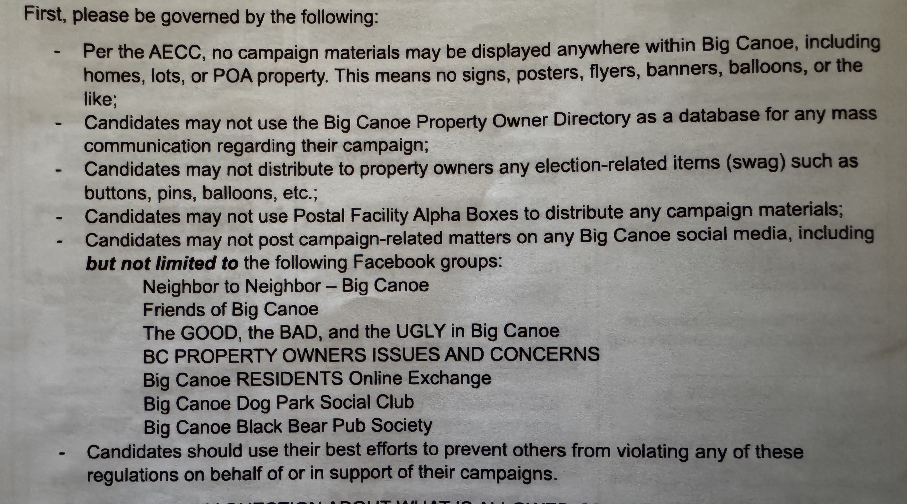
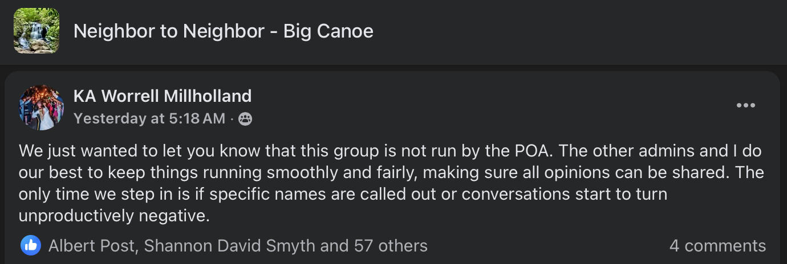

In every thriving community, open conversation is not a disruption — it’s a sign of health. It means people care. It means they’re paying attention. And in Big Canoe, it means we’re invested in the future of the place we call home.

As a candidate for the POA Board, I respect the work of the Election Committee and the desire to ensure a fair, orderly process. But fairness doesn’t require silence — it requires access. And the current restrictions on where and how candidates can speak to residents during the campaign raise important questions.

## Campaign Guidelines

Right now, candidates are being told they cannot share campaign-related content on any Big Canoe–related social media platforms, even in groups or pages run by residents. Instead, communication is limited to official POA-controlled channels: a digital profile, a video recording, and two email sends. While those are helpful tools, they are not sufficient.

The Election Packet provides some guidelines for participation in the election, seen below.

Most of these seem reasonable. Not having campaign yard signs and flyers all across Big Canoe is one of the things I love about living here. There's no clutter to disrupt the natural beauty.

> Candidates may not post campaign-related matters on any Big Canoe social media, including but not limited to the following Facebook groups:
> - Neighbor to Neighbor - Big Canoe
> - Friends of Big Canoe
> - The GOOD, the BAD, and the UGLY in Big Canoe
> - BC PROPERTY OWNERS ISSUES AND CONCERNS
> - Big Canoe RESIDENTS Online Exchange
> - Big Canoe Dog Park Social Club
> - Big Canoe Black Bear Pub Society

Previous conversations with various members of the POA staff and public posts by Facebook moderators (see screenshot below) claim that *Neighbor to Neighbor - Big Canoe* IS NOT a POA run Facebook group. If that's true, then why is the POA attempting to control free speech on that group (and others)?

When I asked Election Committee Chair, Elizabeth Littleton, this question her response was:

> The election committee guidelines are written to provide a level playing field and fair elections for all candidates.  We ensure that equality by producing communications for ALL candidates throughout the cycle:
> - Video taped events: Smoke Signals Q&A, Fireside Chats, and Candidate Forums (You can talk about your campaign platform)
> - Digital: BC Living Candidate Profiles and links to more materials on the election committee website, Amenities Monitors messaging, election cycle key dates, etc.
> - Direct email to Property Owners
>I would suggest you invite the other candidates to your social media forum to truly provide an equal opportunity for public discourse.  Big Canoe policies and decisions are not made in social media, rather by the elected Board of Directors.

I understand and respect the Election Committee’s intent to ensure fairness. The current restriction—prohibiting candidates from posting campaign-related content on any Big Canoe related social media—goes beyond what is reasonable or necessary to achieve that goal.

**Especially when it prevents candidates from posting anything related to Big Canoe for fear of being disqualified from the election.**

This policy effectively prevents open civic dialogue in the very public spaces where residents already gather to share opinions and information. That’s not a level playing field—it’s a narrow corridor controlled by a single committee. The policy raises a fundamental question: how do we know that the three official communication channels being offered—video events, digital profiles, and direct emails—are the fairest or most complete representations of each candidate? Who controls what gets asked, what gets published, and how it’s framed?

I sent this, along with some historical and legal precedent to Ms. Littleton. She has not responded.

**[See full email exchange here](public-campaign-discourse.pdf)**

Residents should be able to engage with candidates where conversations are already happening. They should be able to ask follow-up questions, compare perspectives, and hear how candidates think — not just what’s written in an approved statement. That’s how trust is built. That’s how informed decisions are made.

This is not about disregarding process. It’s about ensuring the process reflects the values of transparency, fairness, and civic participation. Limiting discourse to a narrow set of tightly controlled channels doesn’t level the playing field — it narrows it.

## We can do better.

Let’s allow candidates to speak freely and responsibly across multiple platforms — including the ones residents already use. Let’s trust our community to have thoughtful conversations. And let’s hold ourselves to a higher standard, not just of civility, but of openness.

### This is our election. Our community. Our opportunity to raise the bar.